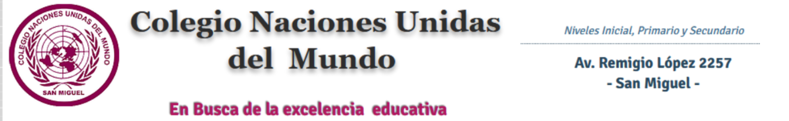

# 🏫 Colegio Naciones Unidas del Mundo - Landing Page

<div align="center">
  
  <p><strong>Sitio web oficial del Colegio Naciones Unidas del Mundo</strong></p>
  <p>Formando Ciudadanos del Mundo</p>
</div>

## 📋 Descripción

Landing page profesional y moderna desarrollada con React + Vite para el Colegio Naciones Unidas del Mundo, ubicado en San Miguel, Buenos Aires, Argentina. El sitio presenta información institucional, niveles educativos y un sistema de contacto integrado.

## ✨ Características

- 🎨 **Diseño Moderno**: Interfaz atractiva con gradientes rojos y animaciones suaves
- 📱 **Totalmente Responsivo**: Optimizado para desktop, tablet y móviles
- 🖼️ **Carousel de Imágenes**: Galería automática con controles interactivos
- 📧 **Formulario de Contacto**: Integración con FormSubmit para envío directo de emails
- 🗺️ **Mapa Interactivo**: Google Maps embebido con la ubicación del colegio
- ⚡ **Alto Rendimiento**: Construido con Vite para carga rápida
- 🎯 **SEO Optimizado**: Estructura semántica y metadatos apropiados
- ♿ **Accesible**: Diseño inclusivo siguiendo mejores prácticas

## 🎓 Niveles Educativos

### Nivel Inicial
- Sala de 3, 4 y 5 años
- Estimulación temprana
- Desarrollo socioemocional
- Introducción al inglés

### Nivel Primario
- 1° a 6° grado
- Educación bilingüe
- Robótica y programación
- Deportes y arte

### Nivel Secundario
- 1° a 6° año
- **Orientación en Programación y Sistemas**
- Bachillerato en Informática
- Programación y desarrollo de software
- Redes y sistemas operativos
- Bases de datos
- Diseño web y aplicaciones móviles

## 🚀 Tecnologías

- **Frontend Framework**: React 18
- **Build Tool**: Vite 5
- **Estilos**: CSS3 con variables y animaciones
- **Formularios**: FormSubmit API
- **Mapas**: Google Maps Embed API
- **Fuentes**: Google Fonts (Poppins)
- **Iconos**: SVG personalizados

## 📦 Instalación

### Prerrequisitos

- Node.js 16+ y npm instalados
- Git

### Pasos

1. **Clonar el repositorio**
```bash
git clone https://github.com/tu-usuario/colegio-naciones-unidas.git
cd colegio-naciones-unidas
```

2. **Instalar dependencias**
```bash
npm install
```

3. **Ejecutar en modo desarrollo**
```bash
npm run dev
```

El sitio estará disponible en `http://localhost:5173`

4. **Construir para producción**
```bash
npm run build
```

Los archivos optimizados se generarán en la carpeta `dist/`

5. **Vista previa de producción**
```bash
npm run preview
```

## 📁 Estructura del Proyecto

```
colegio-naciones-unidas/
├── public/
│   └── images/
│       ├── logo.png
│       ├── carousel1.jpg
│       ├── carousel2.jpg
│       └── carousel3.jpg
├── src/
│   ├── components/
│   │   ├── Navbar.jsx
│   │   ├── Navbar.css
│   │   ├── Hero.jsx
│   │   ├── Hero.css
│   │   ├── Carousel.jsx
│   │   ├── Carousel.css
│   │   ├── About.jsx
│   │   ├── About.css
│   │   ├── Education.jsx
│   │   ├── Education.css
│   │   ├── Contact.jsx
│   │   ├── Contact.css
│   │   ├── Footer.jsx
│   │   ├── Footer.css
│   │   ├── Logo.jsx
│   │   └── Logo.css
│   ├── App.jsx
│   ├── App.css
│   ├── main.jsx
│   └── index.css
├── index.html
├── vite.config.js
├── package.json
└── README.md
```

## 🎨 Paleta de Colores

- **Rojo Principal**: `#dc2626`
- **Rojo Secundario**: `#991b1b`
- **Dorado/Amarillo**: `#fbbf24`
- **Fondo Claro**: `#ffe5e5`
- **Texto Oscuro**: `#1f2937`
- **Texto Claro**: `#6b7280`

## 📍 Información de Contacto

**Dirección:**  
José Remigio López 2257  
San Miguel  
Código postal 1663  
Buenos Aires - Argentina

**Teléfono/Fax:**  
(011) 4455-1849  
(011) 4455-3481

**WhatsApp:**  
11 2624-5628

**Emails:**  
- Información General: info@cnum.edu.ar
- Inicial y Primaria: primaria@cnum.edu.ar
- Nivel Secundario: secundaria@cnum.edu.ar

## 🔧 Configuración del Formulario

El formulario de contacto utiliza FormSubmit. Para cambiar el email de destino:

1. Abre `src/components/Contact.jsx`
2. Busca la línea:
```javascript
const response = await fetch('https://formsubmit.co/ajax/rochaignaciojose@gmail.com', {
```
3. Reemplaza el email con el deseado

## 📱 Responsive Breakpoints

- **Desktop**: > 768px
- **Tablet**: 768px
- **Mobile**: 480px

## 🌟 Características Destacadas

### Carousel Automático
- Transición automática cada 5 segundos
- Controles de navegación (anterior/siguiente)
- Indicadores de posición
- Imágenes optimizadas y uniformes

### Formulario Inteligente
- Validación en tiempo real
- Envío asíncrono sin recargar página
- Mensajes de éxito/error
- Integración directa con email

### Animaciones
- Fade in al cargar secciones
- Hover effects en tarjetas
- Transiciones suaves
- Formas flotantes en hero

## 🤝 Contribuir

1. Fork el proyecto
2. Crea una rama para tu feature (`git checkout -b feature/AmazingFeature`)
3. Commit tus cambios (`git commit -m 'Add some AmazingFeature'`)
4. Push a la rama (`git push origin feature/AmazingFeature`)
5. Abre un Pull Request

## 📄 Licencia

Este proyecto es propiedad del Colegio Naciones Unidas del Mundo. Todos los derechos reservados.

## 👨‍💻 Desarrollado por

**Contacto del Desarrollador:**  
Email: rochaignaciojose@gmail.com

## 🙏 Agradecimientos

- Colegio Naciones Unidas del Mundo por confiar en este proyecto
- Comunidad de React y Vite por las excelentes herramientas
- Google Fonts por la tipografía Poppins

---

<div align="center">
  <p>Hecho con ❤️ para el Colegio Naciones Unidas del Mundo</p>
  <p>© 2024 Colegio Naciones Unidas del Mundo. Todos los derechos reservados.</p>
</div>
